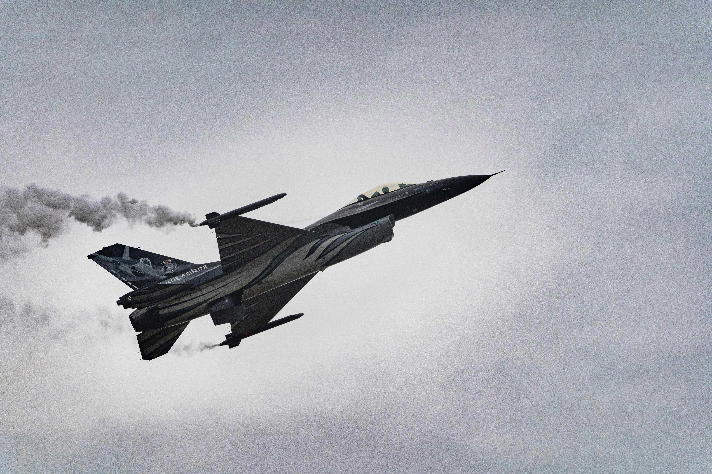
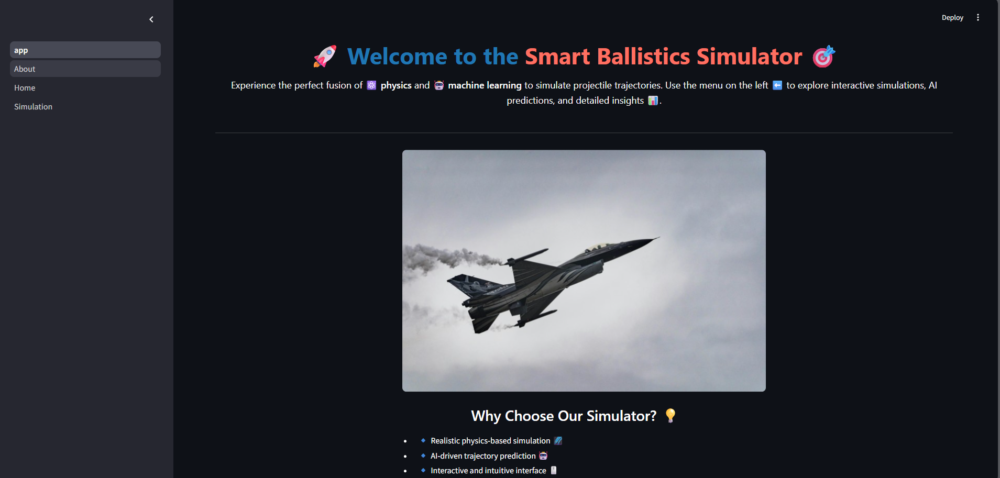
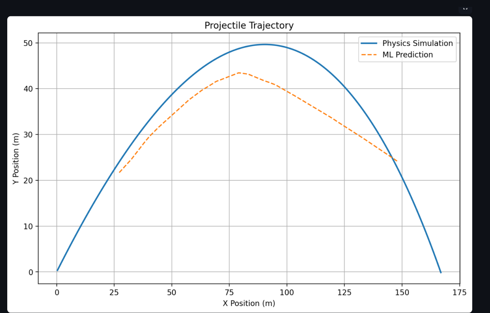

# 🚀 BallistiX: Smart Ballistics Simulator


**BallistiX** is an AI-enhanced ballistics simulator that fuses physics-based modeling with machine learning to predict projectile trajectories with precision and speed.

Built using **PyTorch**, **Streamlit**, and scientific libraries like **NumPy** and **Matplotlib**, it allows users to visualize and compare traditional physics-based trajectories vs. neural network predictions—live, interactive, and with parameter control.

---

## 🧩 Problem Statement

Predicting projectile trajectories in real-world conditions is **computationally intensive** due to non-linear factors like air resistance, wind, and mass variability.


- Traditional simulations solve complex differential equations in real-time.
- They're accurate but slow — especially at scale (defense sims, games, robotics).
- Neural networks can **learn these dynamics** and offer **faster, near-instant predictions**.

 **BallistiX solves this by combining physics and ML**, offering the best of both worlds:
- Verified physical accuracy from traditional methods.
- Fast, real-time inference from a trained ML model.

---

## 🔍 Use Cases

- 🛡️ **Defense & Military**: Simulate and predict projectile motion with various payloads, weather conditions, and launch angles.
- 🎮 **Game Development**: Integrate fast and realistic bullet or object motion into physics-based games.
- 🛰️ **Aerospace & Robotics**: Train drones or launch systems to adapt to wind, payload, or terrain dynamically.
- 📚 **Education**: Visual, interactive tool to teach students projectile motion, neural networks, and real-world physics constraints.
- 🧪 **Research**: Compare physics-based and learned models to study generalization in applied ML.

---

## 🌟 Features

- 🎯 Real-time physics-based simulation of 2D projectile motion
- 🧠 Neural Network predicts X-Y positions based on inputs
- 🌬️ Adjustable wind, velocity, launch angle, and mass
- 🪂 Drag coefficient, gravity, air density factored in
- 📊 Visual overlay of both models for instant comparison
- 🧪 Transparent, editable ML model architecture (PyTorch)
- ⚙️ Powered by a smooth, modern Streamlit UI

---

## 🖼️ Screenshots

| Simulation Interface | Trajectory Output |
|----------------------|-------------------|
|  |  |

---

## 🛠️ Tech Stack

| Component        | Technology Used         |
|------------------|--------------------------|
| Frontend         | Streamlit                |
| ML Framework     | PyTorch                  |
| Data Processing  | NumPy, scikit-learn      |
| Visualization    | Matplotlib               |
| Backend Language | Python 3.9+              |

---

## 📈 Simulation Logic

### Physics-Based
Simulates trajectory using Newtonian equations with air drag and wind:
- Drag = `0.5 * rho * Cd * A * v²`
- Realistic wind resistance, acceleration due to gravity

### ML-Based
A Feedforward Neural Network learns to map:


Model trained on synthetic data generated by the physics engine.

---

## 🚀 Getting Started

```bash
git clone https://github.com/mekhushi/ballistix
cd ballistix
pip install -r requirements.txt
streamlit run app.py
```

----

## 📬 Contact
Questions, feedback, or collaboration ideas?
📧 Email: khushisimgh8317@gmail.com

---

## 📜 License
This project is released under the MIT License.
Feel free to use, adapt, or expand with attribution.


